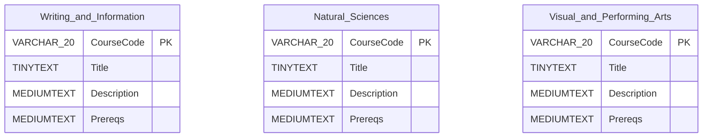

# Course Database Importer

This project collects course information from The Ohio State University's class-search API and prepares it for use by a Django application. Python handles the API requests and text-file generation; Java reads the General Education course data and stores it in a SQLite database through JDBC.

## Project layout

| Path | Purpose |
| --- | --- |
| `src/courses.py` | Fetches course and section data for the configured subjects. |
| `src/ge.py` | Fetches courses grouped by General Education category. |
| `src/database.java` | Creates SQLite tables and inserts the General Education records. |
| `bin/run.sh` | Runs both Python scripts, compiles Java, and starts the importer. |
| `lib/sqlite-jdbc-3.36.0.jar` | SQLite JDBC driver used by Java. |

## Requirements

- Python 3 with the project virtual environment at `.venv/`
- The Python `requests` package
- A JDK with `javac` and `java` on your `PATH`
- Network access to `https://content.osu.edu`

The scripts use relative paths, so commands should be run from the project root.

## Running the importer

From the project root, run:

```bash
bash bin/run.sh
```

The command performs these steps:

1. Runs `src/courses.py`.
2. Runs `src/ge.py`.
3. Compiles `src/database.java` into the project directory.
4. Prompts for the SQLite database filename.
5. Creates one table for each General Education category and inserts the records from `ge.txt`.

When prompted, enter a filename such as `ge.db`. If the file already exists, SQLite opens it and the importer creates any missing tables. Existing rows with duplicate course codes are ignored by the Java code's insert-error handling.

## Database model

The database is organized as one table per General Education category. The category names are used directly as SQLite table names, for example `Writing_and_Information` and `Natural_Sciences`.



All category tables share the same schema:

| Column | SQLite declaration | Description |
| --- | --- | --- |
| `CourseCode` | `VARCHAR(20) PRIMARY KEY` | Subject and catalog number, such as `ENGLISH 1110.01`. |
| `Title` | `TINYTEXT` | Course title. |
| `Description` | `MEDIUMTEXT` | Catalog description. |
| `Prereqs` | `MEDIUMTEXT` | Prerequisite or enrollment restriction text when available; otherwise `NULL`. |

There are currently no foreign keys or relationships between category tables. A course that belongs to multiple categories may therefore appear in more than one table.

## Data sources and refreshes

Both Python scripts query the OSU class-search API. Running the shell script refreshes the text files before the Java import, so a new run may change the available courses as the university's course catalog changes. The API requests require an active network connection and may take some time because many subjects and category pages are requested.

## Notes

- The Java program asks for the database filename interactively; `bin/run.sh` does not supply one automatically.
- The generated files and compiled Java classes are working artifacts. They may be replaced or regenerated by a later run.
- The SQLite driver is loaded from `lib/*` during compilation and execution.
