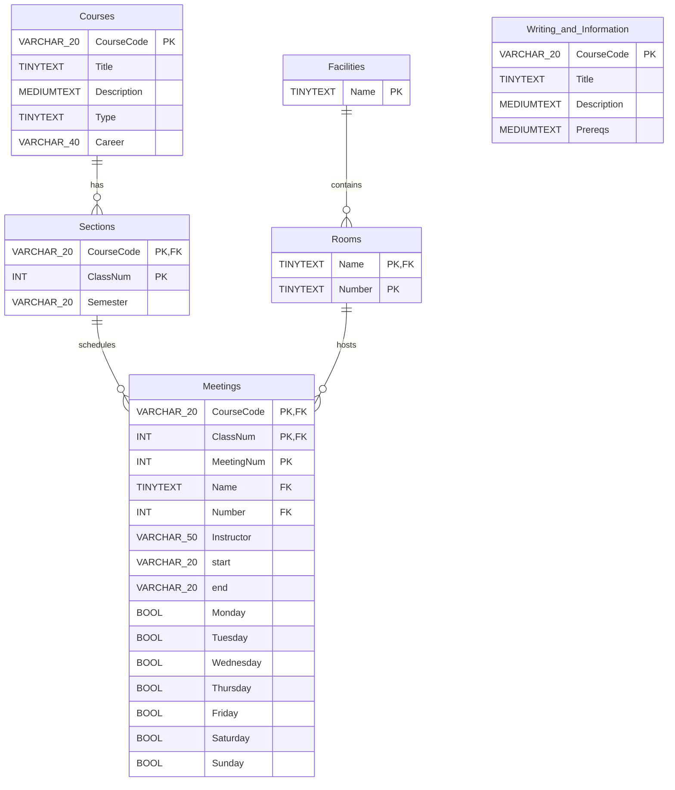

# Course Database Importer

This project collects course information from The Ohio State University's class-search API and prepares it for use by a Django application. Python handles the API requests, creates the main normalized SQLite database, and writes text output for debugging. Java reads the General Education course data and stores it in SQLite through JDBC.

There are two database-import paths:

- `src/courses.py` creates the `Courses`, `Sections`, `Meetings`, `Facilities`, and `Rooms` tables and populates them while it fetches subject data.
- `src/database.java` creates one table per General Education category from `ge.txt`.

The course importer and Java importer ask for database filenames independently. They can write to the same SQLite file if the same name is entered at both prompts, or to separate files if the datasets should remain independent.

## Project layout

| Path | Purpose |
| --- | --- |
| `src/courses.py` | Fetches course and section data for the configured subjects. |
| `src/ge.py` | Fetches courses grouped by General Education category. |
| `src/database.java` | Creates SQLite tables and inserts the General Education records. |
| `bin/run.sh` | Runs both Python scripts, compiles Java, and starts the importer. |
| `lib/sqlite-jdbc-3.36.0.jar` | SQLite JDBC driver used by Java. |

## Requirements

- Python 3 with the project virtual environment at `.venv/`
- The Python `requests` package
- A JDK with `javac` and `java` on your `PATH`
- Network access to `https://content.osu.edu`

The scripts use relative paths, so commands should be run from the project root.

## Running the importer

From the project root, run:

```bash
bash bin/run.sh
```

The command performs these steps:

1. Runs `src/courses.py`.
2. Runs `src/ge.py`.
3. Compiles `src/database.java` into the project directory.
4. Prompts for the SQLite database filename used by `courses.py`, then fetches and stores course, section, meeting, facility, and room data.
5. Prompts again for the SQLite database filename used by Java.
6. Creates one table for each General Education category and inserts the records from `ge.txt`.

When prompted, enter a filename such as `ge.db`. If the file already exists, SQLite opens it and the relevant importer creates any missing tables. Existing rows with duplicate keys are logged to `errors.txt` by the Python script or ignored by the Java importer's insert-error handling.

## Database model

The Python database is organized around a course, its offerings in a semester, and the meetings for each offering. Facilities and rooms are stored separately so multiple meetings can refer to the same location. The Java database adds one table per General Education category; those tables are independent of the normalized course tables.



### Python-created tables

| Table | Columns | Purpose |
| --- | --- | --- |
| `Courses` | `CourseCode` primary key, `Title`, `Description`, `Type`, `Career` | One catalog course. `Type` stores the subject area/category name collected by the script. |
| `Sections` | Composite primary key: `CourseCode`, `ClassNum`; `Semester` | A particular class offering of a course. |
| `Meetings` | Composite primary key: `CourseCode`, `ClassNum`, `MeetingNum`; location, instructor, time, and weekday columns | A scheduled meeting belonging to a section. |
| `Facilities` | `Name` primary key | A building or facility name. |
| `Rooms` | Composite primary key: `Name`, `Number` | A room within a facility. |

The schema declares foreign keys from `Sections` to `Courses`, from `Meetings` to `Courses` and `Sections`, and from `Rooms` to `Facilities`. The `Meetings` table also declares a composite foreign key to `Rooms` using `(Name, Number)`.

`courses.txt` contains a human-readable dump of the fetched course hierarchy for debugging. It is not read back into SQLite; the Python script inserts those records directly while it processes the API response.

### Java-created GE tables

The Java importer creates one table per General Education category. The category names are used directly as SQLite table names, for example `Writing_and_Information` and `Natural_Sciences`. All category tables share this schema:

| Column | SQLite declaration | Description |
| --- | --- | --- |
| `CourseCode` | `VARCHAR(20) PRIMARY KEY` | Subject and catalog number, such as `ENGLISH 1110.01`. |
| `Title` | `TINYTEXT` | Course title. |
| `Description` | `MEDIUMTEXT` | Catalog description. |
| `Prereqs` | `MEDIUMTEXT` | Prerequisite or enrollment restriction text when available; otherwise `NULL`. |

The GE tables have no foreign keys to `Courses` or to one another. A course that belongs to multiple categories may therefore appear in more than one GE table. `CourseCode` is the primary key within each category table.

## Data sources and refreshes

Both Python scripts query the OSU class-search API. Running the shell script refreshes the course data and `ge.txt` before the Java import, so a new run may change the available courses as the university's course catalog changes. The API requests require an active network connection and may take some time because many subjects and category pages are requested.

## Notes

- The Java program asks for the database filename interactively; `bin/run.sh` does not supply one automatically.
- The generated files and compiled Java classes are working artifacts. They may be replaced or regenerated by a later run.
- The SQLite driver is loaded from `lib/*` during compilation and execution.
